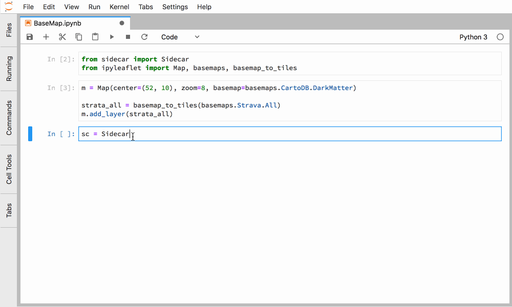

# Sidecar

[](https://travis-ci.org/jupyter-widgets/jupyterlab-sidecar)
[](https://codecov.io/gh/jupyter-widgets/jupyterlab-sidecar)

A sidecar output widget for JupyterLab

## Installation

If you use jupyterlab:

```bash
pip install sidecar
jupyter labextension install @jupyter-widgets/jupyterlab-manager
jupyter labextension install @jupyter-widgets/jupyterlab-sidecar
```

## Usage

The sidecar widget is used as a context manager, just like ipywidgets' output
widget.

```python
from sidecar import Sidecar
from ipywidgets import IntSlider

sc = Sidecar(title='Sidecar Output')
sl = IntSlider(description='Some slider')
with sc:
    display(sl)
```

When a single output is displayed in a Sidecar, it is allowed to occupy all of
the vertical space available. If more content is displayed, the natural height
is used instead.


