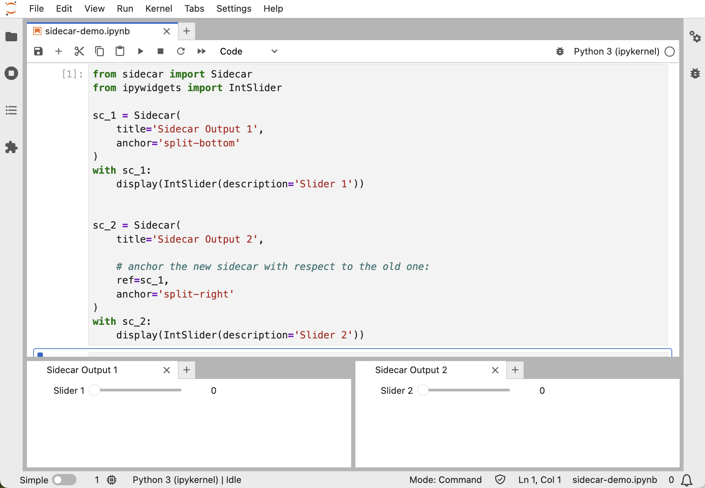

# Sidecar

[](https://travis-ci.org/jupyter-widgets/jupyterlab-sidecar)
[](https://codecov.io/gh/jupyter-widgets/jupyterlab-sidecar)

A sidecar output widget for JupyterLab

## Installation

```bash
pip install sidecar
```

or

```bash
conda install sidecar
```

If you use JupyterLab `<=2`:

```bash
jupyter labextension install @jupyter-widgets/jupyterlab-manager
jupyter labextension install @jupyter-widgets/jupyterlab-sidecar
```

## Usage

The sidecar widget is used as a context manager, just like ipywidgets' output
widget.

```python
from sidecar import Sidecar
from ipywidgets import IntSlider

sc = Sidecar(title='Sidecar Output')
sl = IntSlider(description='Some slider')
with sc:
    display(sl)
```

When a single output is displayed in a Sidecar, it is allowed to occupy all of
the vertical space available. If more content is displayed, the natural height
is used instead.


### Opening a sidecar in the main work area

By default, a sidecar will be displayed on the right panel, which has some limitations:
There is a maximum width, and it can't be displayed at the same time as other elements
in the right panel.

The `anchor` parameter can be used with values `'split-right'`, `'split-left'`,
`'split-top'`, `'split-bottom'`, `'tab-before'`, or `'tab-after'` to open a sidecar in a
new JupyterLab window which can be re-arranged as desired.


### Arrange a new sidecar with respect to another sidecar

The `anchor` parameter sets the position of the new sidecar relative to the 
notebook that opens the sidecar, by default. To open a new sidecar whose `anchor` 
is defined relative to another sidecar output, set the `ref` parameter with
the instance of the reference sidecar.

For example:



## Development

```bash
# Create a new conda environment
conda create -n jupyterlab-sidecar -c conda-forge jupyterlab ipywidgets nodejs -y

# Activate the conda environment
conda activate jupyterlab-sidecar

# Install package in development mode
pip install -e .

# Link your development version of the extension with JupyterLab
jupyter labextension develop . --overwrite

# Rebuild extension Typescript source after making changes
jlpm run build
```

You can watch the source directory and run JupyterLab at the same time in different terminals to watch for changes in the extension's source and automatically rebuild the extension.

```bash
# Watch the source directory in one terminal, automatically rebuilding when needed
jlpm run watch
# Run JupyterLab in another terminal
jupyter lab
```

With the watch command running, every saved change will immediately be built locally and available in your running JupyterLab. Refresh JupyterLab to load the change in your browser (you may need to wait several seconds for the extension to be rebuilt).

By default, the jlpm run build command generates the source maps for this extension to make it easier to debug using the browser dev tools. To also generate source maps for the JupyterLab core extensions, you can run the following command:

```bash
jupyter lab build --minimize=False
```

## Uninstall

```bash
pip uninstall sidecar
```

or

```bash
conda uninstall sidecar
```
